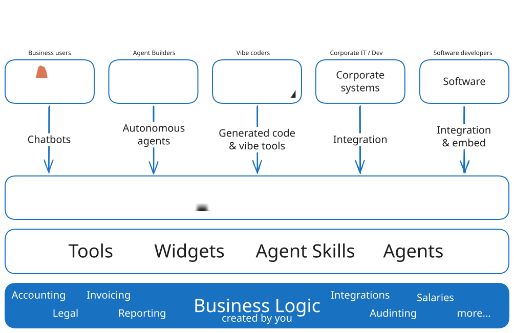
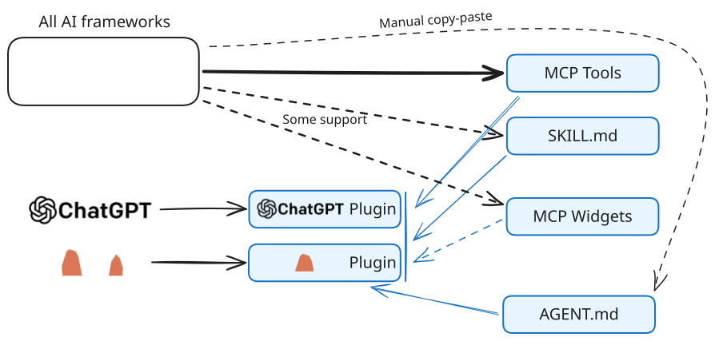
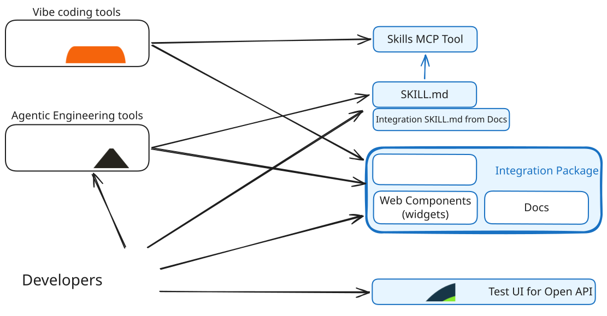

<!--
  GENERATED FILE — DO NOT EDIT DIRECTLY.
  Source: quartal-vault/Products/Plugins.md in the quartal docs repository.
  Regenerate with: pnpm export:plugin-readme (in the docs repository root)
-->

# _Quartal **Plugins**_
_Quartal **Plugins**_ are packaged business functionality for **AI agents**: Chatbots, Autonomous agents as well as Vibe coding tools. However, the packaging is done in a way that also more **traditional software** such as SaaS software and internal Corporate systems and automation can use the same packages. The functionalities are packaged as Tools (services), Widgets (UI), Agent Skills and Agents.


The basic idea is that you can create a _Quartal **Plugins**_ package once containing all the business logic for a specific business domain. You can then publish that package as a simple web site and other people inside or outside your organization can use that logic in different chatbots, agents, vibe tools, integrations and other software using Model Context Protocol ([MCP](https://modelcontextprotocol.io/)), [Open API](https://www.openapis.org/) (REST), [Claude plugins](https://code.claude.com/docs/en/plugins), [Agent skills](https://agentskills.io/) and more...

> [!NOTE]
> **Under construction**
> We are currently pushing _Quartal **Plugins**_ to TEST as of 08/2026 and v01 PROD in 09/2026. This description is written for the PROD target stage in 09/2026: Some features described below may not be present in the current published version.

## Getting Started
Requirements:
- Node, version 20+
- We recommend using [MCPJam](https://www.mcpjam.com/) for local testing, especially for widgets

With PNPM:
```bash
pnpm create @quartal-hub/plugin
```

With NPM:
```bash
npm create @quartal-hub/plugin
```

Alternatively, you may also just fork the template repository in [https://github.com/quartal-hub/plugin-template](https://github.com/quartal-hub/plugin-template)

Once you have run the template / starter-kit, follow the instructions in the `README.md` or use your favourite development agent to modify your project.

## Easy MCP Tools as plain TypeScript
In most [MCP Tools](https://modelcontextprotocol.io/docs/2026-07-28/learn/server-concepts#tools) frameworks, you are required to write the input and output schemas with tools like Zod, e.g.:
```ts
import { z } from "zod";
import { type InferSchema } from "xmcp";

export const schema = {
  name: z.string().describe("User's full name"),
  email: z.string().email().describe("Valid email address"),
  age: z.number().optional().describe("User's age, optional"),
  role: z.enum(["admin", "user"]).describe("User role"),
};

export default async function createUser(args: InferSchema<typeof schema>) {
  // args is automatically typed: { name: string; email: string; age?: number; role: "admin" | "user" }
  const { name, email, age, role } = args;
  // Implementation here
}

// More configuration such as metadata deifinition is omitted from this example.

```

in a _Quartal **Plugin**_ the same is written in **plain TypeScript** classes and functions:
```ts
// file:/src/tools/HelloWorldInput.ts
/** Schema for the hello method */
export interface HelloWorldInput {
  /** User's full name */
  name: string;
  /**
   * Valid email address
   * @format email
   */
  email: string;
  /**
   * User's age, optional
   * @format int32
   */
  age?: number;
  /** User role */
  role: "admin" | "user";
}

// file:/src/tools/HelloWorld.ts
import type { HelloWorldInput } from "./HelloWorldInput.ts";

/**
 * A class that says hello to the world.
 */
export class HelloWorld {
  /**
   * Function with advanced parameters.
   * @param input Greeting fields (name, age, gender, keywords).
   */
  createUser(input: HelloWorldInput): string {
    // implementation here
    return "User created: " + input.name;
  }
}

// file:/src/tools/mod.ts

// All the public functions in classes exported from "/src/tools/mod.ts"
// will be exported as MCP Tools AND actions in Open API / REST services.
export * from "./HelloWorld.ts";

```

Description and TypeScript types are the most important information that is passed via MCP all the way to the AI agents. These are important for the Tool (function) as well as all the properties of input and output types so that an AI agent knows how to use them. In addition, we also support most of the JSON schema features including enumerations and formats like email, date, datetime etc.

What's more, the types can be any imported classes or interfaces, even from external packages, which makes code reuse in types much easier. This of course also means that the types are real TypeScript types, not some Zod inferred types which are ugly and painful to debug when something goes wrong.
## MCP Apps Widgets: Add UI to your tools
You can easily add custom user interface to interact with any of your tools. This has the following benefits:
- The Tool results and further interaction UI will be rendered exactly as you specify, not something that the model vibes on-the-fly (no hallucinations).
- User saves a lot of tokens: tokens are not used for UI rendering
- Widget UI renders many times faster than when streamed from the model on-the-fly

[MCP Apps](https://modelcontextprotocol.io/extensions/apps/overview) standard is supported by the state-of-the-art chatbots, namely Anthropic Claude, OpenAI ChatGPT and M365 Copilot as well as _Quartal **Hub**_ and _Quartal **Messages**_ / _Quartal **Harness**_ embeddable user interfaces. Other chat clients not supporting Widgets fall back to rendering UI by the AI model.

_Quartal **Plugins**_ is based an Astro so you can use basically any of your favourite UI framework such as [React, Vue, Svelte, Plain JavaScript, and more](https://docs.astro.build/en/guides/framework-components/). See our `quartal-hub/plugin-template` repository for an example in Vue: Creating a widget is as easy as creating a Vue page in Vue / Astro project. We will be providing more examples in other frameworks later.

## Everything the AI Agents need in one package
For example, if you create a plugin for integrating with an invoicing SaaS software that you provide, you might build:

- A couple of  **Tools**:
	- One for creating an invoice
	- Another for listing all invoices with their status
- A **Skill** for explaining how invoices should be created with all the regulatory requirements and how they will be sent, e.g. if they need an approval (for security) in your own UI
	- Agent Skills standard is defined in https://agentskills.io/ and supported by most advanced AI tools
- A **Widget** for displaying the invoice as it would be shown as PDF / print-out
- Couple of **Agents**
	- One that creates an invoice based on text or voice input in **interactive chat**
	- Another as an **autonomous agent** that monitors invoices and sends a report for those that have not been paid by the due date

We make creating these artifacts very easy:
- A **Tool** is just a **TypeScript function**, we will automatically create **Model Context Protocol Service (MCP)** and wire the function as an **MCP Tool**
- A **Widget** is just an Single Page Application with your favourite framework: **Vue, React, Svelte** etc.
- An **Agent** is just a markdown or JSON file.
- A **Skill** is just a folder with markdown files with other assets.

Basically all AI agents now consume MCP Tools, so that is all good, but support for MCP Apps widgets is still limited and even with skills, you have an issue that there is no consistent way of updating them as you make changes and fixes.

We solve a lot of these issues by for example packaging Agents, Tools, Widgets and Skills as [Claude Plugins](https://code.claude.com/docs/en/plugins-reference), that you may optionally publish. This allows Claude users to connect to only one plugin and get all artifacts on one go. Also, this allows for automatic updates for all of these artifacts including the skills. [ChatGPT Plugins](https://openai.com/index/chatgpt-plugins/) provide a similar functionality, but at the moment without the Agents. You can however manually copy-paste the Agent definitions / prompts to ChatGPT as to basically any other agent framework. 

In the picture below, all the blue components will be generated by _Quartal **Plugins**_ infra from your business logic and code so you do not need to worry about it:


## ... plus everything for Software devs from same source
MCP Tools are great for AI Agents, but when you are creating an app or integration, either "vibe coded" or by professional developers, you really want to connect to a real API. For this, we automatically create an [**Open API**](https://www.openapis.org/) compatible rest API with full documentation to developers. We also expose the **UI widgets** as [Web Components](https://developer.mozilla.org/en-US/docs/Web/API/Web_components) that may be easily integrated to any web UI. 

We generate documentation about all this as:
- Docs for human developers
- Integration Skill for vibe / engineering agents -- added besides business skills developed by you.
- Swagger UI for testing the API endpoints
- Widget tester for testing the UI widgets

As many Vibe coding tools (e.g. Lovable) do not support Agent Skills, we provide a separate MCP Tool endpoint for browsing skills content. Skills content is also linked to the Docs for human or agent usage.
## Security and Authentication
You may provide your plugin as anonymous if your tools do not require any authentication, but often you need to authenticate the user to connect to external systems. For this we provide standard OAuth2 authentication mechanisms that will then be wired through:
- MCP Tools and Widgets
- Open API
- Web Component
- Test UIs: Swagger and widget tester

We provide out-of-the box authentication support using our _Quartal **IAM**_ which recognizes out-of-the-box individuals and companies in Finland from authorities so that you can truly authenticate your users as companies. But you may also use any OAuth2.1 compatible authentication solution (as specified in the MCP spec).

Note that at least in the current version, Skills, Agents, plugin source code and documentation are always anonymous: you should place any confidential data inside Tools instead of embedding it into Skills or Agents. This is also generally the best practice.
## Deploy your plugin
When you have tested your plugin, you deploy it as a [dynamic Astro web site to any modern hosting platform](https://docs.astro.build/en/guides/deploy/). From there anyone can already use the plugin. You may optionally publish your package to [NPM](https://www.npmjs.com/) or [JSR](https://jsr.io/) package registries. This allows developers to use your Tools directly in their code without the http overhead from their server to you published server.
### Publish in _Quartal **Hub**_
After deployment, you may register your plugin in _Quartal **Hub**_ which is a registry for plugins and an easy place for:
- Users to discover plugins
- Test them with authentication
- Manage plugins and authorize them to agents and users within their organization
## Open Source and Zero Lock-in
_Quartal **Plugins**_ is an open source project with MIT license. It is based on [Astro](https://astro.build) (also MIT) and can be easily [deployed to any modern hosting platform](https://docs.astro.build/en/guides/deploy/). UI Widgets can be created using any of your favourite UI framework such as [React, Vue, Svelte, Plain JavaScript, and more](https://docs.astro.build/en/guides/framework-components/).
## Capabilities
We make it as easy as possible to provide a set of business functionality in one simple package:

- **Tools:** Reusable code that can be executed by agents and software via:
    - **MCP Tools** by AI agents
    - **Open API / REST service** by agents, vibe coded software and other services
    - **NPM or JSR packages** in TypeScript / JavaScript code, if published to NPM/JSR.
- **Widgets** as defined by MCP Apps standard
    - Provide user interfaces to interactive chat agents like Claude or Chat GPT
    - We will probably provide a way to use them from React and Vue etc. apps as well
- **Agent Skills** that guide AI agents on how to use these tools and other business logic

We create extensive documentation pages for all the above services. As part of that process, we also serve all the files and folders in the `/public` folder the same way as public folder is shown in Vue apps.
## Getting Started
Requirements:
- Node, version 20+
- We recommend using [MCPJam](https://www.mcpjam.com/) for local testing, especially for widgets

With PNPM:
```bash
pnpm create @quartal-hub/plugin
```

With NPM:
```bash
npm create @quartal-hub/plugin
```

Alternatively, you may also just fork the template repository in [https://github.com/quartal-hub/plugin-template](https://github.com/quartal-hub/plugin-template)

Once you have run the template / starter-kit, follow the instructions in the `README.md` or use your favourite development agent to modify your project.

## Contributing
As we are still publishing the first v01 version, we do not accept any PRs or feedback at this time. This will change as we get the first version up-and-running. Check back in September - October 2026 timeline for how to contribute.
